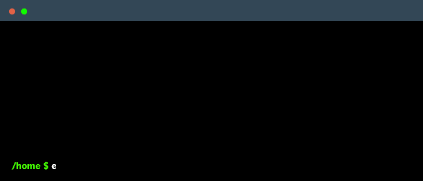

## 👋 Welcome!

<!-- You can create your own terminal GIF here: https://www.terminalgif.com -->

    

### Languages

  
  
  
  
  
  
  
  
  
  
  
  

### Frameworks, Platforms & Libraries

  
  
  
  
  
  
  
  

### Databases

  
  
  
  

### DevOps

  
  
  
  
  
  

## 📩 Contact

## ⚙️ GitHub Stats

---

> "The only constant in the technology industry is change." – Marc Benioff

Thanks for stopping by! 🚀