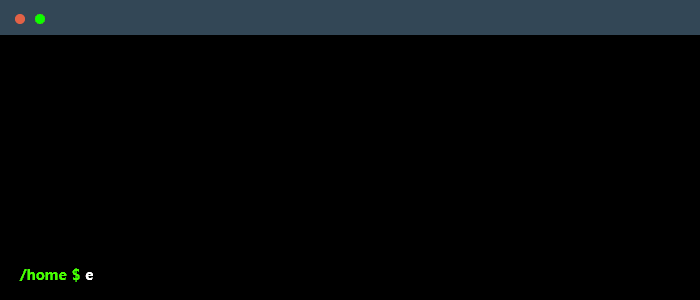

## 👋 Welcome!

    

### Languages

  
  
  
  

### Frameworks & Libraries

  
  
  
  
  

### Databases & ORM

  
  

### DevOps & Tools

  
  
  
  
  

## 📩 Contact

## ⚙️ GitHub Stats

---

> "The only constant in the technology industry is change." – Marc Benioff

Thanks for stopping by! 🚀
